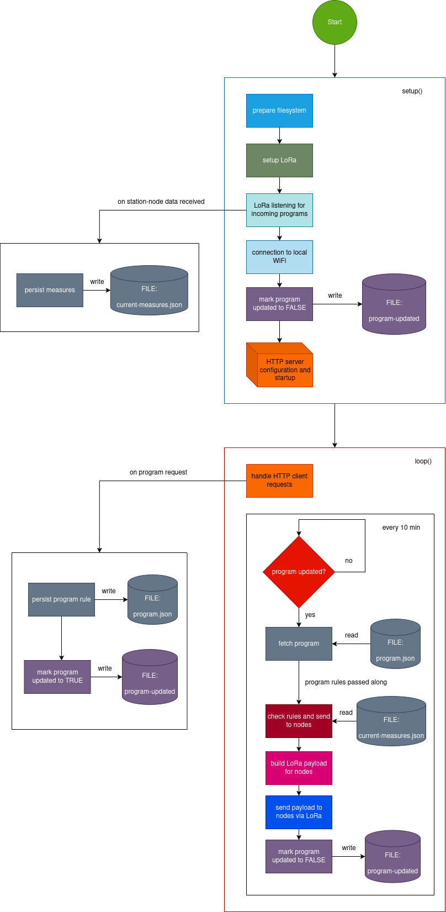

# Repository Overview

This project contains firmware for two types of nodes based on Arduino/ESP32 and LoRa:

- **master-node**: Listens for LoRa packets from sensor nodes, filters messages addressed to "master-node", and processes the payloads (e.g., prints to serial, forwards to a backend, etc.).
- **station-node**: Reads temperature and humidity from a DHT22 sensor and ambient light via a photoresistor, packages the data into a JSON payload with a `"to":"master-node"` field, and sends it over LoRa.

---

## Repository Structure

```
├── master-node/
│   └── master-node.ino      # Master node firmware
├── station-node/
│   └── station-node.ino     # Station (sensor) node firmware
├── README.md                # This guide (English version)
└── doc/                     # Flow diagram images (.jpg)
```

---

## Prerequisites

- **Development Environment:**
  - Arduino IDE (>= 1.8.13) or PlatformIO
- **Arduino Libraries:**
  - `LoRa` by Sandeep Mistry
  - `DHT sensor library` by Adafruit
  - `SPI` (bundled with Arduino)
- **Hardware:**
  - 2× Arduino or ESP32-based boards (3.3 V compatible)
  - 2× LoRa SX1276/78 radio modules
  - 1× DHT22 temperature & humidity sensor
  - 1× Photoresistor (LDR) + fixed resistor (≈10 kΩ)
  - Jumper wires and power supply

---

## Hardware Setup

### master-node

| LoRa Module Pin | Board Pin |
| --------------- | --------- |
| NSS (CS)        | 10        |
| RESET           | 9         |
| DIO0            | 2         |
| SPI SCK         | 13        |
| SPI MOSI        | 11        |
| SPI MISO        | 12        |
| 3.3 V           | 3.3 V      |
| GND             | GND       |

### station-node

| Component      | Pin    |
| -------------- | ------ |
| DHT22 DATA     | 2      |
| DHT22 VCC      | 5 V     |
| DHT22 GND      | GND    |
| LDR Divider    | A0     |
| LoRa NSS (CS)  | 18     |
| LoRa RESET     | 14     |
| LoRa DIO0      | 26     |
| SPI SCK        | 5      |
| SPI MOSI       | 27     |
| SPI MISO       | 19     |

---

## Software Setup

1. Clone the repository:
   ```bash
    git clone https://github.com/grimimirg/gartner-nodes.git
   ```
2. Install libraries in Arduino IDE:
   - Sketch > Include Library > Manage Libraries...
   - Search for and install **LoRa** and **DHT sensor library** (Adafruit).
3. Open sketches:
   - `master-node/master-node.ino`
   - `station-node/station-node.ino`

---

## Build & Upload

### master-node

1. Select the correct board type (e.g., Arduino Uno or ESP32 Dev Module).
2. Select the COM port.
3. Upload `master-node.ino`.

### station-node

1. Select the correct board type.
2. Select the COM port.
3. Upload `station-node.ino`.

---

## Interactions between Station-Node and Master-Node

1. **Station-Node** wakes up and reads sensors:
   - Temperature and humidity from DHT22.
   - Raw analog light level from LDR, converted to percentage.
2. **Payload construction**:
   ```json
   {
     "to": "master-node",
     "temperature": 24.30,
     "humidity": 60.00,
     "lightPercent": 45.20
   }
   ```
3. LoRa transmission at 868 MHz in broadcast mode.
4. **Master-Node** continuously listens for packets:
   - Calls `LoRa.parsePacket()` to detect incoming data.
   - Reads full payload as string.
   - Checks the `"to"` field: if it matches `"master-node"`, the packet is accepted.
   - Extracts sensor values and processes them (e.g., prints to serial, logs to SD card, or forwards via a backend).
5. **Optional Acknowledgment:** You may extend the protocol so that the master-node replies with an ACK packet containing e.g. `{ "ack": true, "id": "station-1" }`.

---

## Operation

- Station-Node executes every minute (configurable): reads sensors, builds JSON payload, sends via LoRa, then sleeps or delays.
- Master-Node runs in a loop: filters incoming messages, processes valid ones, and ignores others.

---

## Flow Diagrams

### Master Node Flow



### Station Node Flow


### Master Node Flow


---

## Customizations

- **Frequency:** change `LORA_FREQ` to `915E6` for the US band.
- **Send interval:** modify the `delay(60000)` in `station-node`.
- **Payload format:** switch to CSV, binary, or a more compact JSON as needed.

---

## Debug & Troubleshooting

- Verify SPI wiring and 3.3 V power to LoRa modules.
- Use the Serial Monitor at 115200 baud for debug prints.
- Measure RSSI on the master-node:
  ```cpp
  int rssi = LoRa.packetRssi();
  Serial.print("RSSI: "); Serial.println(rssi);
  ```
- Ensure both nodes use the same frequency and spreading factor settings.

---

## License

This project is released under the MIT License.
